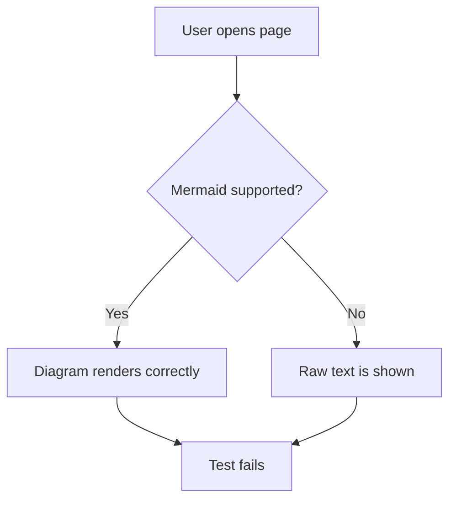

Trap based class / subclass?

Martial v Magic is resource up or down?
Martial stances generate momentum that can be spent for powers
Magic spells expend mp to cast spells.

A full Martial has a class trigger or two to gain Momentum ontop of their Stance triggers.
A full Magic has ? more spells?

Spells work like a column, you must learn the bottom tier to get the tier above.
Sorcerer (if we have one) can ignore this

Mob rules: https://ninesides.substack.com/p/mob-rules-for-d-and-d-5e ?
Savage Isles / West Marches with Fortress: https://substack.com/inbox/post/177695916

---
# Stats
## D&D
Strength, Dexterity, Constitution, Intelligence, Wisdom, Charisma

### What do we like about this?
It works,
Split between Strength and Dex
Split between Intelligence and Wis

### What do we not like about this?
Constitution is a weird stat
Charisma is too powerful a single stat.
D&D names

What if remove Constitution and put that in Strength?
What if we remove Charisma completely?

Strength, Dexterity, Intelligence, Wisdom

---

## LANCER
Hull, Systems, Agility, Engineering

### What do we like about this?
Everyone wants everything

### What do we not like about this?
Entirely mech based which doesn't work for us where we want to blend the two

This gives us Strength/Constitution; Intelligence; Dexterity; Constitution 2

---
## Fabula Ultima
Might, Dexterity, Insight, Willpower

This is essentially what we get when processing D&D.
They tie Willpower to charisma which i personally don't like, 

This gives us Strength/Constitution, Dexterity, Intelligence, Wisdom/Charisma

---
## Pillars of Eternity
Might, Constitution, Dexterity, Perception, Intellect, Resolve

Everyone wants everything,
Might is damage, Constitution is hp, Dex is attack speed (which we cant do), Perception is accuracy, Intellect is AOE size and Duration, Resolve is concentration

---

## BREAK!!

Might, Deft, Grit, Insight, Aura

This is essentially Strength, Dex, Con, Wis, Cha. Really dont like this.

---

What do you want to do:

Exploration: 
- Physical Strength - Push down a tree, leap a chasm, climb
- Perception - Find another route
- Build a bridge
- Throw and tie a rope, cross using that

Combat:
- Tank - Disabler / Tough
- DPS - Skirmisher / Ranged
- Controller - Debuff / Terrain
- Support - Buffs / Actions / Heals

Social:
- Intimidation (Fear)
- Persuasion (Happiness)
- Deception (Anything else)
- Logic (Understanding)
- Bribery (Fulfilled)
- Guilt
- Authority (Weak)
- Flirt (Infatuation)

If we do
Strength - Force
Dexterity - Precision
Fortitude - Overexerting
Awareness - Perception, survival
Intelligence - Logic and recall
Intuition - Focus, Insight, Animal Handling  

---
# Keyword:

    Archon - JUDGE
    Bard - INFLUENCE
    Berserker - DESTROY
    Chimera - HUNT
    Commander - DIRECT
    Diviner - WARP
    Druid - NURTURE
    Etcher - DESIGN
	Hierophant - AMPLIFY
    Knight - PROTECT
    Necromancer - CONTROL ? CORRUPT
    Oathsworn - VOW
    Pathfinder - NAVIGATE
    Quartermaster - SUPPLY
    Rogue - STEAL
    Spellblade - ENCHANT
    Inquisitor - CONNECT
    Tinker - ENGINEER
    Vessel - BRIDGE
    Witch - REPAY
    Wizard - LEARN
# Rolls

What do we want:
When youre good at something, you're consistently good at those rolls.
When youre bad at something, you consistently roll badly and have little chance of succeeding.
When youre middling at something, you can try and fail.

Definitely want some form of flat modifier on rolls.
-10 to +10? to d20. Base stats are -5 to +5?

Do we want dual stats to a roll?
- Means being good at one thing isnt enough but you can really good at multiple things.
- More complicated
- Some rolls can just be one stat? Do we want to do STR + STR for a break check then?
- Allows 6 stats to become 15 / 21 combos
Do we want stat die?

Do we add some variant of level to roll?
- Means you roll higher as you level
- Means you are better than lower levels.
- Some things are level gated.
- I like this
- Level runs from 2 to 30.
- Level bonus runs from 1 to 10
- Proficiency level runs in 4 tiers, 0.5, 1, 1.5, 2
- Proficiency 1.5 is unlocked at level 10 and Proficiency 2 is unlocked at level 20
- This goes back to 5e and away from Pathfinder 2e where any proficiency adds full level bonus
- Also 1.5 is a terrible number

STR + DEX = 
STR + FOR = Might
STR + AWR =
STR + INT =
STR + INS =
DEX + FOR = 
DEX + AWR = Balance 
DEX + INT = Precision
DEX + INS = 
FOR + AWR =
FOR + INT = Wit
FOR + INS = 
AWR + INT = Slyness
AWR + INS = Presence
INT + INS = Charisma

---

# Currency
Silver Standard
1 cp = £1
1 sp = £100
1 gp = £10,000

The average labourer makes 1sp per day and 3gp a year

---

# Death

The soulcatcher item is a cheap for adventurer's item. Maybe 10gp for basic version. Prohibitively expensive and useless for most people.
It stores the soul in it for an amount of time after death (1 minute?), while the soul is in inside, resurrection magic an be cast on it to bring the character back.
Resurrection is a ritual that takes as long as the character is dead.
Higher tier resurrection can deal with damaged bodies and soulcatcher being removed for a little bit.
Necromancer has a soulcatch reaction spell that can do this immediately after death.

---
# Bond

Build up to 3 bonds, bonds have a nature which is a word and levels which are die size, 
d4 -> d6 -> d8 -> d10 -> d12
To increase the die size you have to ? do something that has to do with the bond's nature.
When the die size increases you can change the bond's nature
Get to add the die to something? Maybe something related to [[#Keyword]]?
Bonds can be towards a character or organisation?
You can finalise the bond during a Scene, for that scene, any time you gain momentum, instead gain dice/2. Or immediately gain dice mana?
Then that bond ends and you either change it or reset it or leave it blank.

Should be easier to increase bond to character than organisation because the wider it becomes, the more often it will come up?
Maybe if the organisation bond is just a bond to its leader?

If you finalise the bond and say the villain gets away, what happens to your bond? expended?
When you Invoke a Bond, declare your Goal, if you fail, your Bond stays. 

---
# Skills

Strength
- Athletics
- Break
Dexterity
- Deft
- Agility
Fortitude
- Endure
Awareness
- Perception
- Investigate
Intellect
- Logic
- Deduce
Instinct
- Insight

---

Athletics (STR + FOR)
Bend and Break (STR + STR)

Craft (PHY + IN?)

Stealth (DEX + AWR)
Sleight of Hand (DEX + INS)

Endure (FOR + )

Perception (AWR + INS)
Examination (AWR + INT)

Deduction (INT + INS)
Magic 
Society
Nature
Are spirits a different lore?

Animal Handling
Insight (INS + AWR)
Medicine?
Survival?

Persuasion
Deception (IN? + AWR)
Intimidation

---

Athletics
Break
Craft

Spot
Examine

Arcana
Nature

Intuition
Animal Handling / Riding / Piloting ?

Persuasion
Manipulation
Logic ? Is this just INT Persuasion?
Coercion

---
Archon:
- Destroy things (Physique)
- See through lies (Insight)
- Demand things, be forceful but not necessary threatening, imposing (Society)
- Appear unbreakable (Physique)
Bard:
- Lie (Decieve)
- Charm (Persuasion)
- Make friends
- Flirt
- Tell stories and sing songs (Society)
- Explore (Traverse)
Berserker:
- Break things (Infiltrate)
- Intimidate (Coerce)
- Blacksmith (Nature/Society/Tech)
- Endure (Physique)
- Lift, carry, be strong (Physique)
Chimera:
- Hunt (Nature)
- Live in nature / Be suited for any environment (Nature)
- Connect with animals / speak with them (Nature)
- Mutate (Tech)
- Break the concepts of nature, be forbidden (Arcana)
- Traverse any environment (Traverse)
- Understand biology and medicine, doctor (Physique)
Commander:
- Direct people (Society / Nature)
- Plan strategy and tactics ()
- Be cunning and perceptive (Search)
- Have an aura (Society)
Diviner:
- Know things others do not (Insight)
- See things others cant (Search)
- Be occult (Arcana)
- Really good insight? (Insight)
- Lie? (Decieve)
Druid:
- Connect with nature, speak with it (Nature)
- Know about nature and nurture it (Nature)
- Be a bit hippy wise (Insight)
Etcher:
- Design things and build them (Tech)
- Spot weaknesses (Search)
- Know things about history or nature building materials and architecture (Society)
- A connection to history and the past (Society)
- Set traps ()
Hierophant: 
- Give wise advice (Society)
- Heal (Physique)
- Make things better
- Make things worse
- Knowledge of religion and spirits or society (Nature/Society)
- Soul focus, bolstering souls, enfeebling souls, ghost forms? (Arcana)
Knight:
- Protect people 
- Persuade people (Persuade)
- Be virtuous and have an aura (Society)
- Know about politics and history (Society)
- Ride horse (Nature)
Necromancer:
- Speak to the dead and thus know history (Arcana / Society)
- Know about spirits and magic
- Medicine (Physique)
- Maybe some Scienc Tech (Tech)
Oathsworn:
- Promise (Persuade)
- Intimidate (Coerce)
- Work (Society)
Pathfinder:
- Perceive (Search)
- Survive in Nature (Nature)
- Use Traps
- Hunt animals (Nature)
- Skin animals (Nature)
- Traverse environments (Traverse)
Quartermaster:
- Barter / Buy / Sell
- Convince and talk (Persuade)
- Bribe (Persuade)
- Work (Society)
Rogue:
- Pick locks (Infiltrate)
- Sneak (Infiltrate)
- Pick pockets (Search)
- Create poisons (Nature)
Spellblade:
- Enchant (Arcana)
- ???
Inquisitor:
- Mind stuff
- Connect to people (Insight / Society)
- Know about magic (Arcana)
- Be tough (Physique)
Tinker:
- Create technical stuff (Craft)
- fix tech stuff (Examine)
- know tech stuff (Arcana)
- GUN (Tech)
- Ride car (Tech)
Vessel:
- Know about spirits and elements (Nature)
- Survive in nature (Nature)
- See through lies (Insight)
- Endure the environment (Nature)
Witch:
- Know about occult stuff (Arcana)
- Know about nature (Nature)
- Create potions (Craft)
- Lie (Deceive)
Wizard:
- Study and Learn
- Know about Arcana (Arcana)
- Steal magic (Search)
- Work (Society)

| **Arcana**     |
| -------------- |
| **Coerce**     |
| **Deceive**    |
| **Insight**    |
| **Infiltrate** |
| **Nature**     |
| **Persuade**   |
| **Physique**   |
| **Search**     |
| **Society**    |
| Tech           |
| **Traverse**   |

# Mermaid Test

---
# Scifi DLC

New classes:
Pilot - Jet, Tank, Car, Mech
Doctor - Martial Healer / Buffer / Debuffer
Quantum - Scientist that uses Item Points as mana for spells
Psion - Inquisitor but more hardcore spellcasting, more like Stars without number spells
Hacker - Debuffs weapons, hacks into environment, tech everywhere - networking capabilities

Tinker, Inquisitor, Etcher, Diviner? get buffs

---

# Tables

I am the \_\_\_(1)\_\_\_ of  \_\_\_(2)\_\_\_

|               |     | 1            | 2               |
| ------------- | --- | ------------ | --------------- |
| Archon        |     | Ruler        | The Law         |
| Bard          |     | Singer       | Hearts          |
| Berserker     |     | Enrager      | Destruction     |
| Chimera       |     | Shapeshifter | Beasts          |
| Commander     |     | Leader       | Strategy        |
| Diviner       |     | Seer         | The Unknowable  |
| Druid         |     | Cultivator   | The Land        |
| Etcher        |     | Architect    | Cities          |
| Font          |     | Nexus        | Magic           |
| Inquisitor    |     | Seeker       | Minds           |
| Knight        |     | Protector    | The People      |
| Necromancer   |     | Bloodmage    | The Dead        |
| Oathsworn     |     | Steward      | Pact            |
| Pathfinder    |     | Tamer        | Paths           |
| Quartermaster |     | Armory       | Coin            |
| Rogue         |     | Thief        | Shadows         |
| Spellblade    |     | Enchanter    | Mana & Momentum |
| Tinker        |     | Inventor     | Technology      |
| Vessel        |     | Host         | Spirits         |
| Witch         |     | Alchemist    | Hospitality     |
| Wizard        |     | Student      | Knowledge       |

| Evil              | Neutral                                     | Good                               |
| ----------------- | ------------------------------------------- | ---------------------------------- |
| I care my own ___ | I care about the ___ of people I care about | I care about the ___ of all people |

| d   |       |
| --- | ----- |
|     | Money |
|     | Power |
