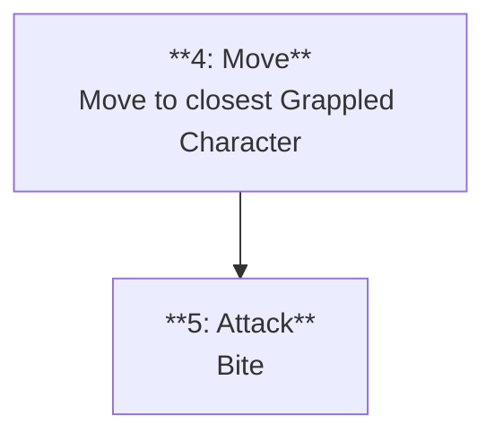

# Overview

# Stat Block

| 
Zombie
           | <                                                                                                                                                                                                                            | <                  | <                  | <                     | <                 |
| --------------------------------- | ---------------------------------------------------------------------------------------------------------------------------------------------------------------------------------------------------------------------------- | ------------------ | ------------------ | --------------------- | ----------------- |
| [[Health Points\|Max HP]]         | <                                                                                                                                                                                                                            | 15                 | <                  | <                     | <                 |
| [[AI]]: [[Robotic]]               | <                                                                                                                                                                                                                            | [[Speed]]: 3       | <                  | [[Seek]]: 1           | <                 |
|                                   | <                                                                                                                                                                                                                            | <                  | <                  | <                     | <                 |
| [[Defence]]                       | <                                                                                                                                                                                                                            | [[Resolve]]        | <                  |                       | <                 |
| 6                                 | <                                                                                                                                                                                                                            | 6                  | <                  |                       | <                 |
| [[Deflection]]                    | <                                                                                                                                                                                                                            | [[Sturdy]]         | <                  | [[Willpower\|Will]]   | <                 |
| 0                                 | <                                                                                                                                                                                                                            | 0                  | <                  | -                     | <                 |
|                                   | <                                                                                                                                                                                                                            | <                  | <                  | <                     | <                 |
| [[Strength\|STR]]                 | [[Dexterity\|DEX]]                                                                                                                                                                                                           | [[Fortitude\|FOR]] | [[Awareness\|AWR]] | [[Intelligence\|INT]] | [[Instinct\|INS]] |
| +3                                | -2                                                                                                                                                                                                                           | +4                 | 0                  | -2                    | -2                |
|                                   | <                                                                                                                                                                                                                            | <                  | <                  | <                     | <                 |
| **Passive Abilities**             | <                                                                                                                                                                                                                            | <                  | <                  | <                     | <                 |
| **Undying**                       | When this [[Rules/Characters/index\|Character]] would die from damage that isn't [[Elemental Type\|Light]] or a [[Critical Strike\|Crit]] and has more than 1 [[Health Points\|HP]], it survives on 1 [[Health Points\|HP]]. | <                  | <                  | <                     | <                 |
| **Necromantic Source**            | When this [[Rules/Characters/index\|Character]] dies from damage that isn't [[Elemental Type\|Light]], gain 1 [[Power Point]].                                                                                               | <                  | <                  | <                     | <                 |
|                                   | <                                                                                                                                                                                                                            | <                  | <                  | <                     | <                 |
| **Active Abilities**              | <                                                                                                                                                                                                                            | <                  | <                  | <                     | <                 |
| ![[#Bite]]                        | <                                                                                                                                                                                                                            | <                  | <                  | <                     | <                 |
|                                   | <                                                                                                                                                                                                                            | <                  | <                  | <                     | <                 |
| ![[#Attack]]                      | <                                                                                                                                                                                                                            |                    | <                  |                       | <                 |
|                                   | <                                                                                                                                                                                                                            | <                  | <                  | <                     | <                 |
| **Tags:** <tags>[[Undead]]</tags> | <                                                                                                                                                                                                                            | <                  | <                  | <                     | <                 |

# Lore

# Additional

## Bite
<hidden>

|                                                                                         | <                       |
| --------------------------------------------------------------------------------------- | ----------------------- |
| **Tempo:** [[Strike]]                                                                   | <                       |
| **[[Hit]]:** +4                                                                         | **[[Damage]]:** 1d4 + 3 |
| **Special:** [[Grappling]] counts if any [[Ally]] is [[Grappled\|Grappling]] the target | <                       |
| **Tags:** <tags>[[Natural]] [[Melee]] 1 [[Grappling]]</tags>                            | <                       |
</hidden>

## Attack

